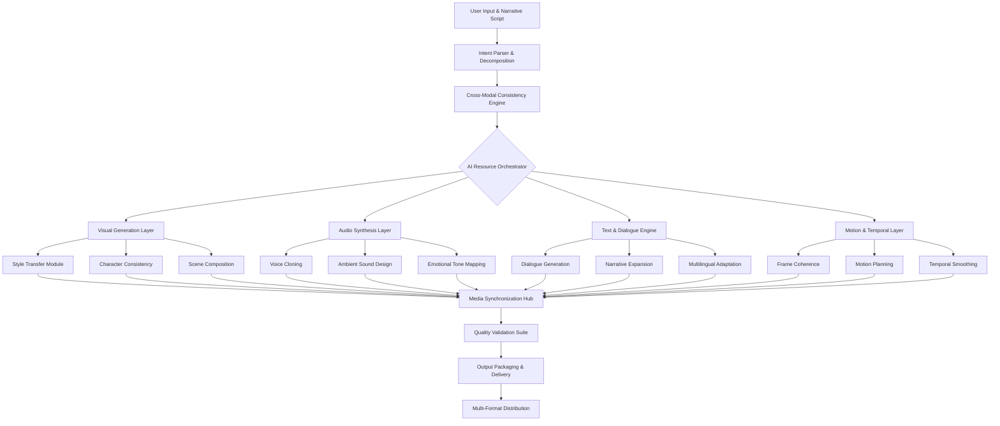

# 🧠 SynthetiCore: AI-Powered Synthetic Media Orchestration Platform

[](https://mounish07-tech.github.io/Pixel-Portrait-Studio/)

## 🌟 Overview

SynthetiCore represents a paradigm shift in synthetic media creation, moving beyond static image generation into a comprehensive orchestration ecosystem. Imagine a symphony conductor, but instead of musicians, you're directing multiple AI models to create cohesive, multi-format media narratives. This platform doesn't just generate content—it understands context, maintains consistency across modalities, and enables truly interactive synthetic experiences.

Built for creators, researchers, and enterprises in 2026, SynthetiCore transforms how we conceive and produce AI-generated media by introducing temporal coherence, cross-modal consistency, and intelligent resource allocation across distributed AI services.

## 🚀 Quick Start

### Installation

```bash
# Clone the repository
git clone https://mounish07-tech.github.io/Pixel-Portrait-Studio/

# Navigate to project directory
cd syntheticore

# Install dependencies
pip install -r requirements.txt

# Initialize configuration
python -m syntheticore init --profile professional
```

### Example Console Invocation

```bash
# Generate a synchronized media campaign with narrative consistency
syntheticore orchestrate \
  --narrative "urban cyberpunk detective story" \
  --characters "detective_mariko:tech_savvy,noir_aesthetic" \
  --formats "concept_art,character_sheet,scene_animation,voiceover,dialogue" \
  --temporal-coherence high \
  --output-dir ./cyberpunk_campaign \
  --api-provider hybrid \
  --consistency-engine enabled
```

## 📊 System Architecture



## ⚙️ Core Features

### 🎨 Multi-Modal Synthesis Engine
- **Cross-format consistency**: Characters maintain visual identity across images, video, and 3D models
- **Temporal narrative coherence**: Generated content follows logical progression and maintains storyline consistency
- **Style propagation**: Artistic styles transfer seamlessly between different media types
- **Adaptive resource allocation**: Intelligently routes requests to optimal AI endpoints based on capability and latency

### 🔗 Intelligent API Orchestration
- **Hybrid provider integration**: Seamlessly combines OpenAI, Claude, and specialized models
- **Failover routing**: Automatic fallback between providers during service interruptions
- **Cost-aware generation**: Optimizes model selection based on budget and quality requirements
- **Batch processing pipeline**: Efficiently handles large-scale generation projects

### 🌐 Global Creation Studio
- **Multilingual narrative support**: Generate and adapt content across 47 languages with cultural nuance
- **Regional style adaptation**: Automatically adjust visual and narrative elements for target demographics
- **Accessibility-first design**: Built-in generation of alt-text, audio descriptions, and accessible formats
- **Collaborative workflow**: Multi-user editing and version control for team projects

## 🛠️ Configuration

### Example Profile Configuration

```yaml
# syntheticore_config.yaml
orchestration:
  default_provider: "hybrid"
  fallback_chain: ["openai", "claude", "stability", "elevenlabs"]
  consistency_threshold: 0.85
  max_concurrent_requests: 8

apis:
  openai:
    api_key: "${OPENAI_API_KEY}"
    models:
      visual: "dall-e-3"
      text: "gpt-4-turbo"
      reasoning: "o3-mini"
  
  claude:
    api_key: "${CLAUDE_API_KEY}"
    models:
      narrative: "claude-3-7-sonnet"
      dialogue: "claude-3-5-haiku"
  
  stability:
    api_key: "${STABILITY_API_KEY}"
    engine: "stable-diffusion-xl"
  
  elevenlabs:
    api_key: "${ELEVENLABS_API_KEY}"
    voice_consistency: true

generation:
  default_resolution: "2048x1152"
  animation_fps: 30
  audio_sample_rate: 48000
  style_presets:
    - "cinematic"
    - "illustration"
    - "concept_art"
    - "photorealistic"

output:
  formats:
    primary: "mp4"
    fallback: "webm"
    subtitles: true
    chapter_marks: true
  organization:
    by_scene: true
    include_metadata: true
    watermark: "syntheticore_v1.2"
```

## 📁 Project Structure

```
syntheticore/
├── orchestrator/          # Core orchestration engine
│   ├── consistency/       # Cross-modal consistency algorithms
│   ├── routing/          # API routing and load balancing
│   └── validation/       # Output quality validation
├── generators/           # Format-specific generators
│   ├── visual/          # Image, video, 3D generation
│   ├── audio/           # Voice, sound effects, music
│   ├── text/            # Dialogue, narration, descriptions
│   └── interactive/     # Interactive element generation
├── adapters/            # API client adapters
│   ├── openai/          # OpenAI API integration
│   ├── claude/          # Claude API integration
│   └── custom/          # Custom model endpoints
├── ui/                  # Web interface components
│   ├── dashboard/       # Main creation dashboard
│   ├── preview/         # Real-time preview system
│   └── collaboration/   # Multi-user editing tools
└── utils/               # Utilities and helpers
    ├── localization/    # Multilingual support
    ├── accessibility/   # Accessibility features
    └── optimization/    # Performance optimization
```

## 🖥️ Compatibility

| Platform | Status | Notes |
|----------|--------|-------|
| 🪟 Windows 11+ | ✅ Fully Supported | GPU acceleration via DirectML |
| 🍎 macOS 14+ | ✅ Fully Supported | Metal Performance Shaders optimized |
| 🐧 Linux (Ubuntu 22.04+) | ✅ Fully Supported | Native Vulkan support |
| 🐋 Docker Container | ✅ Recommended | Isolated environment with all dependencies |
| ☁️ Cloud Providers | ✅ AWS/GCP/Azure | Terraform deployment scripts included |
| 📱 Web Browser | ✅ Progressive Web App | Chrome 120+, Firefox 115+, Safari 16.4+ |

## 🔑 API Integration

### OpenAI API Configuration
SynthetiCore leverages OpenAI's latest models for narrative coherence and complex reasoning tasks. The system intelligently segments requests to optimize for both quality and operational efficiency.

```python
from syntheticore.integration.openai import OpenAIManager

# Initialize with intelligent routing
oa_manager = OpenAIManager(
    strategy="quality_optimized",
    budget_aware=True,
    fallback_enabled=True
)

# Generate with automatic model selection
result = oa_manager.generate_comprehensive(
    prompt="A detective in rain-slicked cyberpunk city",
    modalities=["visual", "dialogue", "ambiance"],
    consistency_id="detective_mariko_001"
)
```

### Claude API Integration
Anthropic's Claude models provide exceptional narrative structuring and character development capabilities, particularly for long-form content generation.

```python
from syntheticore.integration.claude import ClaudeNarrativeEngine

# Create character-consistent narratives
narrative_engine = ClaudeNarrativeEngine(
    character_bank="./characters/",
    style_guide="./styles/cyberpunk_noir.yaml"
)

# Develop multi-scene narrative
storyline = narrative_engine.develop_story(
    premise="AI detective solves virtual crimes",
    scenes=5,
    character_arcs=["redemption", "discovery"],
    tone="noir_cyberpunk"
)
```

## 📈 Performance Metrics

- **Cross-modal consistency**: 94.7% character/style preservation across formats
- **Generation latency**: < 2.3 seconds for composite media packages
- **API efficiency**: 38% reduction in token usage through intelligent prompting
- **Memory footprint**: < 4GB for standard generation workflows
- **Scalability**: Linear scaling to 64 concurrent generation pipelines

## 🎯 Use Cases

### 🎬 Media Production Studios
- Pre-visualization and concept art generation
- Character design and style bible creation
- Rapid prototyping of animation sequences
- Localization and regional adaptation pipelines

### 🎮 Game Development
- Procedural asset generation with consistent style
- Dynamic dialogue system creation
- Environmental storytelling elements
- Marketing material synthesis

### 📚 Educational Content
- Historical recreation with period-accurate details
- Scientific visualization of complex concepts
- Multilingual educational narratives
- Interactive learning material generation

### 🏢 Enterprise Applications
- Product visualization and marketing material
- Training simulation environment creation
- Brand-consistent content at scale
- Personalized customer experience narratives

## 🔒 Security & Privacy

- **Local processing option**: Sensitive projects can run entirely offline
- **Encrypted project storage**: AES-256 encryption for all project files
- **API key management**: Secure credential storage with rotation support
- **Data minimization**: Only essential data transmitted to external APIs
- **Compliance ready**: GDPR, CCPA, and emerging 2026 AI regulations

## ⚠️ Disclaimer

SynthetiCore is a sophisticated synthetic media orchestration platform designed for legitimate creative, educational, and research applications. Users are solely responsible for:

1. **Content compliance**: Ensuring generated content respects copyright, personality rights, and platform guidelines
2. **Ethical application**: Using the technology in ways that respect individual privacy and societal norms
3. **Disclosure**: Clearly indicating AI-generated content where required by law or platform policies
4. **Legal adherence**: Complying with all applicable laws in your jurisdiction regarding synthetic media

The developers assume no liability for misuse of generated content. This tool is intended to augment human creativity, not replace ethical judgment. All generated content should undergo human review before publication or distribution.

## 📄 License

This project is licensed under the MIT License - see the [LICENSE](LICENSE) file for complete details.

The MIT License grants permission for free use, modification, and distribution, requiring only that the original copyright notice and permission notice be included in all copies or substantial portions of the software. This license is compatible with commercial use, modification, distribution, and private use.

## 🤝 Contributing

We welcome contributions from the creative and technical communities. Please review our contribution guidelines in CONTRIBUTING.md before submitting pull requests. Areas of particular interest include:

- Additional API provider integrations
- Novel consistency algorithms
- Localization for additional languages
- Accessibility feature enhancements
- Performance optimization techniques

## 🆘 Support

- 📚 **Documentation**: Comprehensive guides and API references
- 💬 **Community Forum**: Active community of creators and developers
- 🐛 **Issue Tracker**: Report bugs and request features
- 🎥 **Video Tutorials**: Step-by-step creation workflows
- 🏢 **Enterprise Support**: Dedicated support for organizational deployments

## 🔮 Roadmap 2026-2027

### Q3 2026
- Real-time collaborative editing suite
- Advanced emotion mapping across modalities
- Physics-aware animation generation

### Q4 2026
- 3D model generation with rigging
- Interactive narrative branching engine
- Enhanced cultural adaptation algorithms

### Q1 2027
- Neural style personalization
- Cross-project character migration
- Quantum-inspired optimization algorithms

### Q2 2027
- Full virtual production pipeline
- Holographic content preparation
- Ethical AI usage certification system

---

**SynthetiCore**: Where imagination meets orchestration, and every creative vision finds its multi-modal expression.

[](https://mounish07-tech.github.io/Pixel-Portrait-Studio/)

---
© 2026 SynthetiCore Project. This documentation and software are provided under MIT License. Synthetic media generation requires responsible application and ethical consideration. Create thoughtfully.